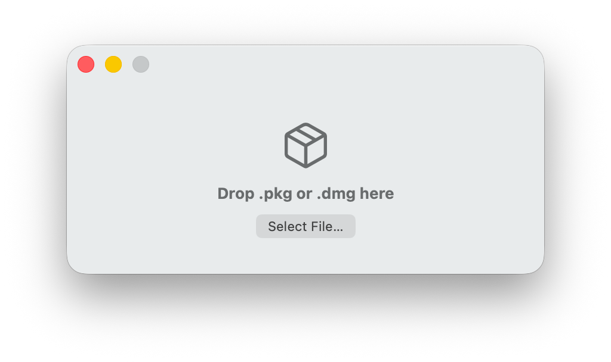
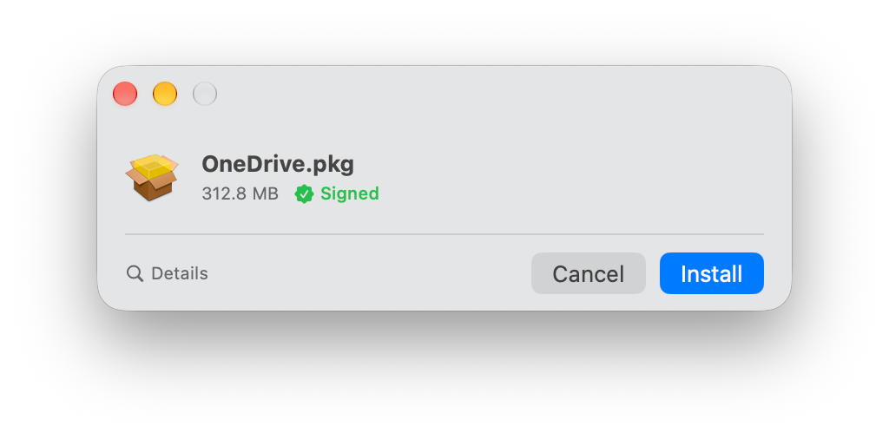
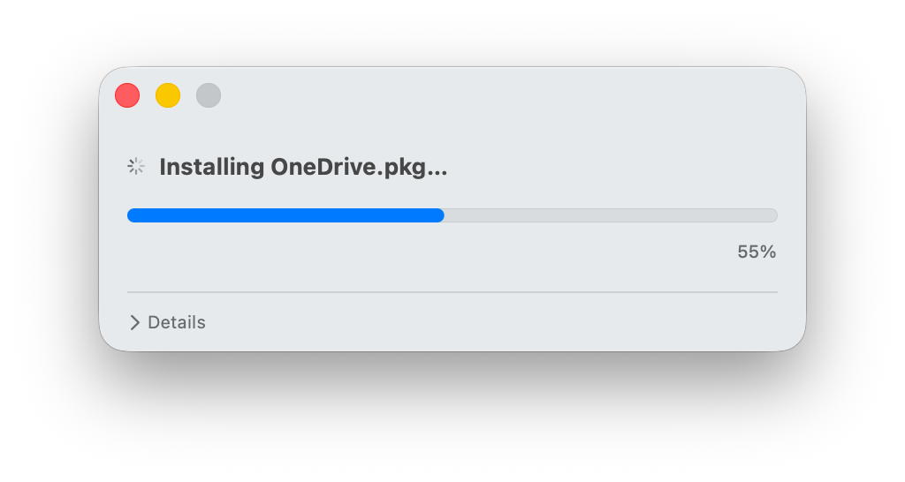
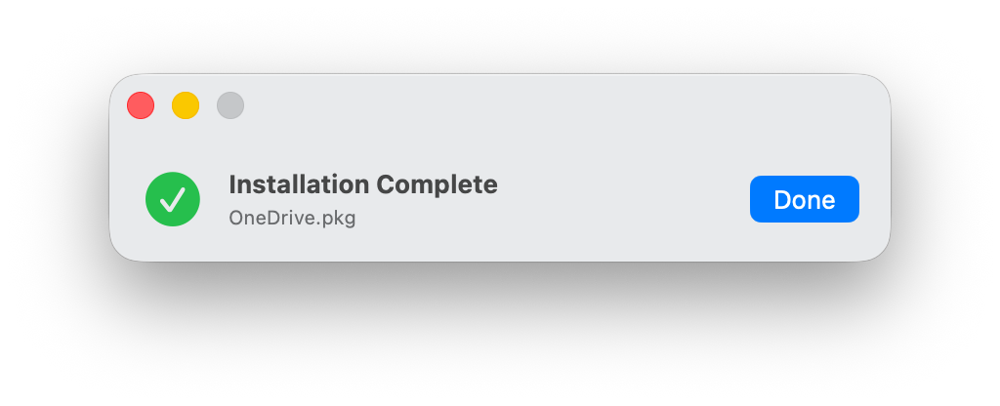
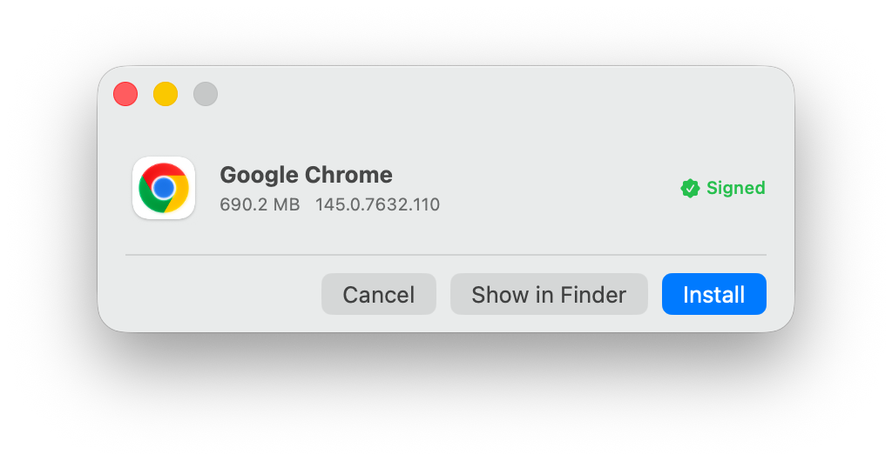
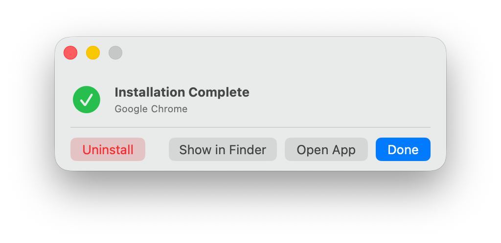

  

<h1 align="center">BoxCutter</h1>

The fastest way to install software on macOS. 
Drop a <code>.pkg</code> or <code>.dmg</code> — BoxCutter installs it in seconds, no friction.

No more double-clicking disk images, dragging to Applications, unmounting volumes, 
or running through multi-step installer wizards. Just drop and go. 
I didn't type a single line of code.

---

## Screenshots

<table>
  <tr>
    <td align="center"> Drop Zone</td>
    <td align="center"> .pkg Preview</td>
    <td align="center"> .pkg Installation Progress</td>
  </tr>
  <tr>
    <td align="center"> .pkg Complete</td>
    <td align="center"> .dmg Preview</td>
    <td align="center"> .dmg Complete</td>
  </tr>
</table>

## Features

- **Instant drag-and-drop** -- Drop any `.pkg` installer or `.dmg` disk image onto the window. BoxCutter takes care of everything from there.
- **One-step DMG installs** -- No more mounting, dragging to Applications, and ejecting. BoxCutter mounts the image, finds the app, copies it, and unmounts — automatically.
- **Package inspection** -- View metadata, payload files, and pre/post-install script warnings before committing to a `.pkg` install.
- **Parallel DMG app installs** -- When a disk image contains multiple apps, BoxCutter installs them all concurrently.
- **Privileged Helper** -- A dedicated launchd daemon handles elevated-privilege operations via XPC, keeping the main app sandboxed.
- **Quarantine fix** -- One-click removal of the macOS quarantine flag on apps installed from DMGs.
- **Safety profiles** -- Maximum, Balanced, or Fast presets control confirmation prompts and post-install cleanup.
- **Verbose output** -- Real-time installer logs and a progress bar during `.pkg` installations.
- **Auto-close** -- Closes automatically after a successful install, with a configurable delay.
- **Sound notifications** -- Configurable system sound plays on completion.

## Requirements

- macOS 15.0 (Sequoia) or later
- Xcode 16+ to build from source

## Building

1. Clone the repository.
2. Open `BoxCutter.xcodeproj` in Xcode.
3. Select your Development Team in the project settings for both the **BoxCutter** and **BoxCutter Helper** targets.
4. Build (`Cmd + B`).

The Privileged Helper is embedded automatically during the build process. On first launch, macOS will prompt you to approve the helper daemon in **System Settings > Login Items & Extensions**.
